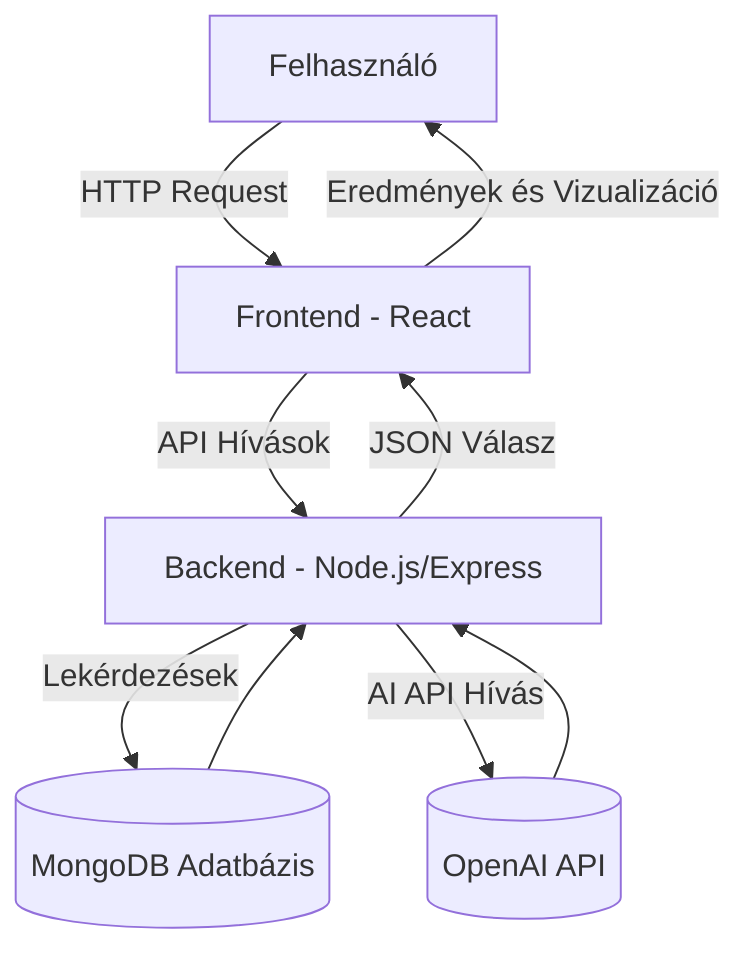
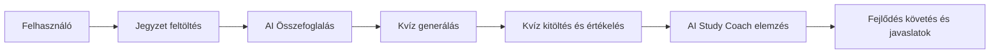
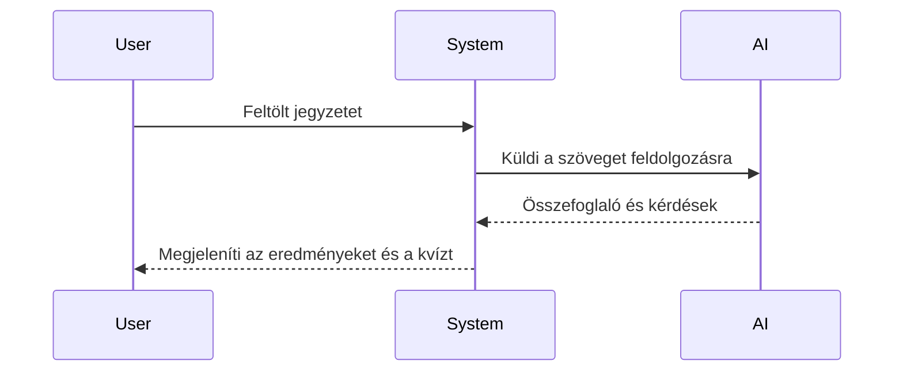
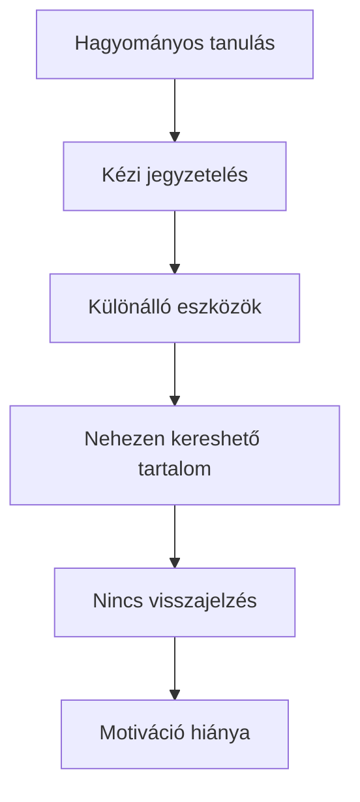
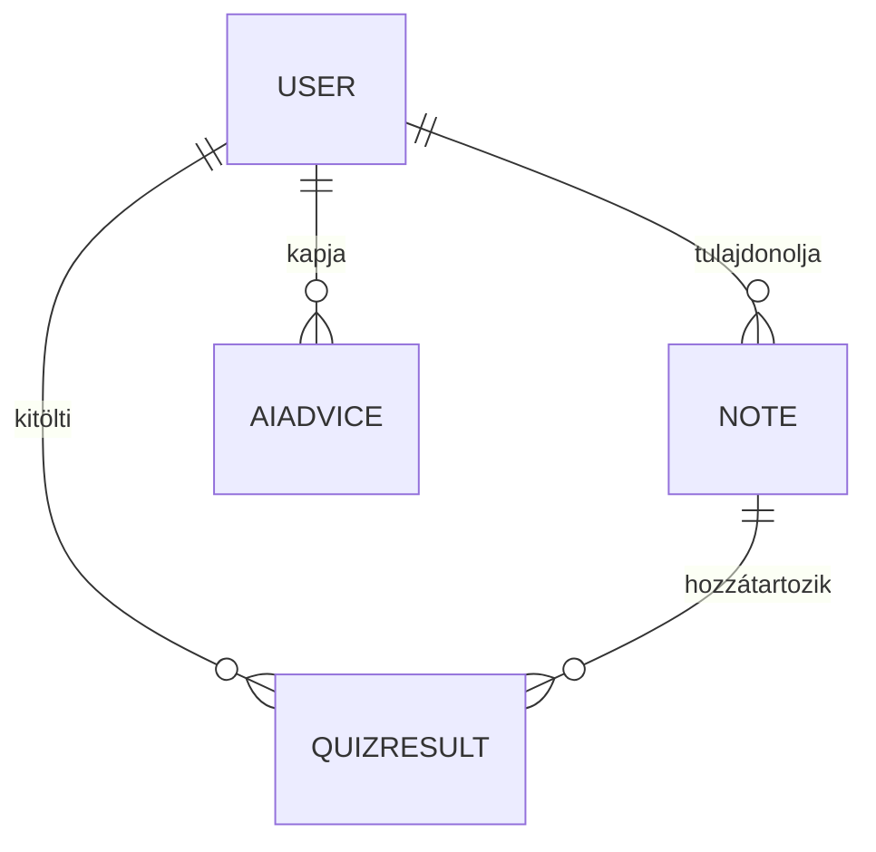
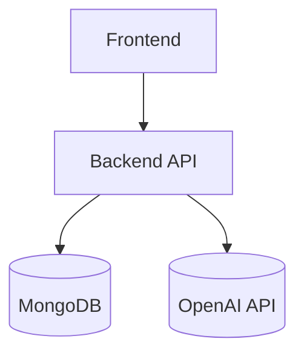
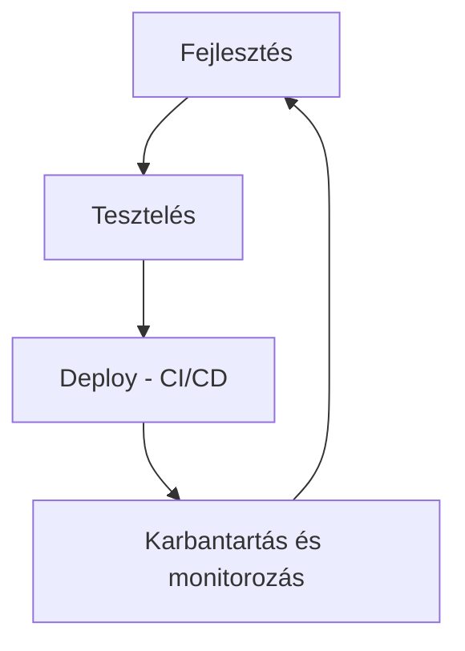

# StudyMate AI – Rendszerterv (Bővített változat)

## 1. Rendszeráttekintés

A **StudyMate AI** egy mesterséges intelligenciával támogatott, webalapú tanulási platform, amely a hallgatók által feltöltött jegyzeteket automatikusan feldolgozza és személyre szabott tanulási anyagokat készít.  
A cél a **tanulás hatékonyságának növelése** és az **önálló tanulási folyamat automatizálása**.

A rendszer három fő rétegre épül:

- **Frontend (React + TailwindCSS):** interaktív, dinamikus és reszponzív felület, amely valós idejű visszajelzéseket nyújt és támogatja a felhasználói aktivitást.
- **Backend (Node.js + Express):** üzleti logika, AI-hívások kezelése, adatfeldolgozás és jogosultságkezelés.
- **Adatbázis (MongoDB):** biztonságos adattárolás, dokumentum-alapú szerkezet és hatékony lekérdezések Mongoose ORM-en keresztül.

A rendszer skálázhatóságát konténerizáció (Docker) és felhőalapú telepítés (pl. AWS vagy Render) biztosítja.

### 1.1 Architektúra leírása

A háromrétegű architektúra lehetővé teszi a **független fejlesztést és karbantartást**, az **API-k modularitását**, valamint a **biztonságos adatátvitelt**.  
A REST API JSON formátumban kommunikál, így könnyen integrálható más oktatási rendszerekkel (pl. Moodle, Canvas).

### 1.2 Cél és használati környezet

A StudyMate AI oktatási intézmények, távoktatási platformok és egyéni tanulók számára készült.  
A rendszer böngészőből fut, támogatja a mobilnézetet, és HTTPS-protokollt, JWT-hitelesítést, valamint automatikus session-kezelést alkalmaz a biztonságos működés érdekében.

---

## 2. Projektleírás és célkitűzések

A projekt célja egy **intelligens tanulástámogató ökoszisztéma** létrehozása, amely AI segítségével elemzi, strukturálja és fejleszti a tanulási folyamatokat.

Fő célkitűzések:

- Időtakarékosság az anyagfeldolgozásban  
- Pontosabb tudásfelmérés automatikus kvízekkel  
- Adaptív tanulási javaslatok az AI Study Coach-tól  
- Központi, biztonságos tanulási környezet biztosítása  

A rendszer MVP verziója a fő funkciókra koncentrál, de előkészített architektúrával rendelkezik későbbi funkciókhoz, mint **progress tracking**, **leaderboard**, vagy **témakör-alapú tanulási statisztikák**.

---

## 3. Vágyálomrendszer leírása

Az ideális StudyMate AI egy **önfejlesztő, interaktív tanulási környezet**, amely valós időben reagál a felhasználó teljesítményére, és dinamikusan módosítja a tananyagokat.  
A rendszer képes:

- felismerni a tudáshiányokat és ezekre célzott gyakorlófeladatokat generálni,  
- grafikonokon megjeleníteni a tanulási trendeket,  
- motivációs elemeket (pl. ranglista, napi cél) integrálni,  
- többnyelvű támogatást biztosítani.

### 3.1 Célrendszer viselkedése

A rendszer **reaktív és prediktív** működésű: az AI nemcsak reagál a bemenetekre, hanem előre is jelez, például mely témakörök nehezek a felhasználónak.

---

## 4. Jelenlegi üzleti folyamatok modellje

A hagyományos tanulás manuális, széttagolt és kevés visszajelzést ad.  
A hallgatók különböző platformokat használnak, ami rontja a hatékonyságot és a motivációt.

A StudyMate AI ezt **egy egységes, automatizált tanulási ökoszisztémával** váltja ki.

---

## 5. Igényelt üzleti folyamatok modellje

A StudyMate AI a **jegyzetfeltöltéstől az AI-alapú visszajelzésig** automatizálja a tanulási ciklust, lehetővé téve az adatvezérelt fejlődést.

Folyamatlépések:

1. Jegyzet feltöltése (PDF, DOCX, TXT)  
2. AI összefoglaló generálása  
3. Kvízkérdések készítése és tárolása  
4. Kvíz kitöltése, pontozás és elemzés  
5. AI Study Coach javaslatok megjelenítése

---

## 6. Funkcionális követelmények

A fő funkciók részletesebben:

- Jegyzetfeltöltés, validálás és tárolás a felhőben  
- AI-alapú összefoglaló készítése kulcspont-kiemeléssel  
- Automatikus kvízgenerálás változatos kérdéstípusokkal  
- Valós idejű pontozás és visszajelzés  
- AI Study Coach ajánlások és motivációs tippek  
- Felhasználói profil, statisztikák, napi célok  
- Kvíz- és jegyzet-előzmények megtekintése  
- Biztonságos bejelentkezés és szerepkör-alapú jogosultságkezelés  

---

## 7. Nem funkcionális követelmények

A rendszernek **gyorsnak, biztonságosnak és megbízhatónak** kell lennie.

### 7.1 Teljesítmény
- API válaszidő < 2s  
- AI hívások cache-elve és async módon kezelve  
- CDN használata a frontend gyorsításához  

### 7.2 Megbízhatóság
- Redundáns szerverek, folyamatos mentés  
- Automatikus újraindítás hibák esetén (PM2 vagy Docker restart policy)  

### 7.3 Biztonság és adatvédelem
- HTTPS, JWT, bcrypt jelszótitkosítás  
- Role-based access control (RBAC)  
- GDPR-kompatibilis adatkezelés és felhasználói hozzájárulás naplózása  

---

## 8. Adatkezelési követelmények

Az adatmodell a négy kulcsentitás közötti kapcsolatot tükrözi, amely támogatja a személyre szabott tanulási útvonalak létrehozását.

A MongoDB dokumentumok tartalmazzák a verziószámot, dátumbélyeget, valamint az AI által generált metaadatokat (pl. kulcsszavak, téma, nehézségi szint).

---

## 9. Használati esetek

### 9.1 Jegyzetfeltöltés  
A fájlokat a rendszer validálja, majd automatikusan indexeli, hogy kereshetőek legyenek.  

### 9.2 Összefoglaló generálása  
Az OpenAI API kulcsszavakat, témákat és rövid, kontextusos összefoglalót készít.

### 9.3 Kvízkitöltés  
A kérdések vegyes formátumúak (f. választós, igaz/hamis, rövid válasz). Az eredmények azonnal mentésre kerülnek.

### 9.4 Profil és statisztika  
A fejlődés grafikonokon jelenik meg (Recharts), heti és havi bontásban.

---

## 10. Rendszerintegrációs követelmények

Integrációk:

- **Frontend:** React + TailwindCSS  
- **Backend:** Node.js + Express  
- **Adatbázis:** MongoDB (Mongoose ORM)  
- **AI:** OpenAI GPT API  
- **Hitelesítés:** JWT  
- **Grafikonok:** Recharts  
- **CI/CD:** GitHub Actions + Render  

---

## 11. Minőségi követelmények

A rendszer minőségét az alábbi tényezők biztosítják:

- **Felhasználói élmény:** intuitív, mobilbarát UI  
- **Teljesítmény:** gyors betöltés, optimalizált lekérdezések  
- **Megbízhatóság:** automatikus hibadetektálás és riasztás  
- **Biztonság:** end-to-end titkosítás, role management  
- **Skálázhatóság:** mikroservice alapú architektúra  

---

## 12. Tesztelési és karbantartási követelmények

### 12.1 Tesztelés
- **Unit tesztek:** minden modulhoz (Jest)  
- **Integrációs tesztek:** API és adatbázis kapcsolat  
- **UI tesztek:** Cypress segítségével  
- **Load teszt:** JMeter-rel a teljesítmény ellenőrzésére  

### 12.2 Karbantartás
- **CI/CD:** automatikus deploy Git push után  
- **Monitoring:** Grafana + Prometheus  
- **Backup:** napi mentés S3 tárhelyre  
- **Verziókezelés:** Git branching stratégia (main/dev)  

