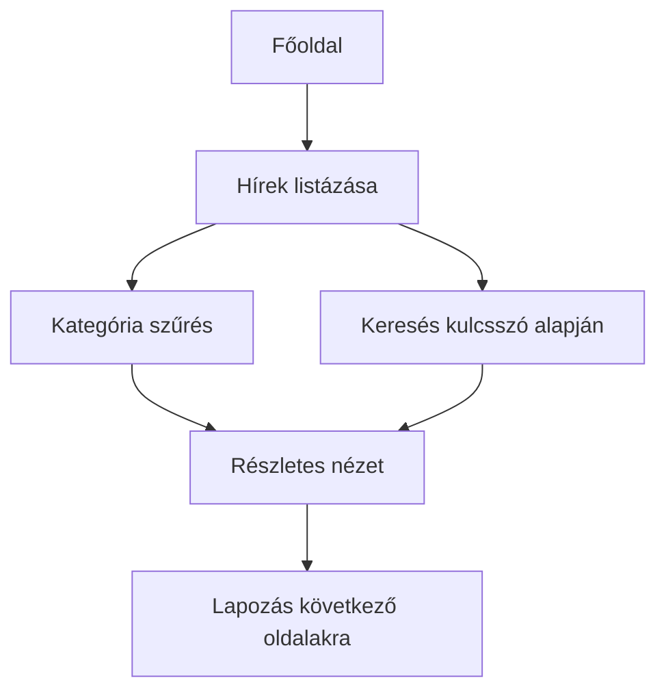

# Rendszerterv – Egyszerű Hírportál

## 1. A rendszer célja

A rendszer célja egy egyszerű webes hírportál létrehozása, amely lehetővé teszi a felhasználók számára a legfrissebb hírek gyors és átlátható elérését. A portál célja, hogy a hírek könnyen kategorizálhatók és kereshetők legyenek, így a látogatók kényelmesen böngészhetnek különböző témákban.

A portál nem foglal magában komplex interaktív funkciókat, mint például felhasználói fiókok létrehozása vagy hozzászólások írása. Ezzel tisztázzuk a projekt hatókörét: a cél a tartalom megjelenítése és egyszerű kezelhetősége.

**Alcélok:**

- Gyors betöltési idő biztosítása minden eszközön.
- Mobilbarát megjelenés a felhasználói élmény növelése érdekében.
- Egyszerű és könnyen karbantartható kódstruktúra kialakítása.

## 2. Projekt terv

### 2.1 Projekt szerepkörök és felelősségek

- **Megrendelő**: meghatározza az elvárásokat, jóváhagyja a projekt mérföldköveit, ellenőrzi az átadott verziókat.  
- **Projektvezető**: felel a projekt ütemezéséért, koordinálja a csapatot, dokumentálja a folyamatokat és a döntéseket.  
- **Frontend fejlesztő**: HTML, CSS és JavaScript fejlesztés, a felhasználói felület megvalósítása.  
- **Tesztelő**: a funkciók működésének ellenőrzése, hibák rögzítése, javaslat a fejlesztői javításokra.  

### 2.2 Fejlesztő eszközök

- VS Code, mint fő fejlesztői környezet.  
- Git verziókezelés a kód nyomon követéséhez.  
- Böngésző fejlesztői eszközök (Chrome/Firefox), hibakereséshez és teljesítmény elemzéshez.  

### 2.3 Ütemterv és mérföldkövek

- **Kezdő fázis**: követelmények rögzítése, tervezési alapok meghatározása.  
- **Fejlesztési fázis**: HTML alapok, CSS stílus és elrendezés, JavaScript funkciók.  
- **Tesztelési fázis**: integrációs és funkcionális tesztek, hibajavítások.  
- **Átadás**: MVP verzió bemutatása, visszajelzések gyűjtése, végső finomhangolás.  

## 3. Üzleti folyamatok modellje

### 3.1 Üzleti szereplők

- **Felhasználó**: látogatja az oldalt, böngészi a híreket, szűr, keres és olvas.  
- **Rendszer**: felelős a hírek megjelenítéséért, kategorizálásáért, keresés és lapozás biztosításáért.  

### 3.2 Üzleti folyamatok

A felhasználó a főoldalon elindulva a híreket kategória vagy kulcsszó alapján szűrheti. A részletes cikk megtekintése után visszatérhet a listaoldalra, vagy lapozhat a következő hírekhez.

**Folyamat lépései:**

1. Főoldal megnyitása.  
2. Hírek listázása, alapértelmezett időrend szerint.  
3. Kategória szerinti szűrés alkalmazása.  
4. Kulcsszó alapján történő keresés.  
5. Részletes cikk megtekintése.  
6. Lapozás a következő oldalakra, ha nagyobb számú hír van.  

### 3.3 Üzleti entitások

- **Hír**: tartalmazza a címet, kivonatot, teljes szöveget, dátumot és kategóriát.  
- **Kategória**: azonosító és név alapján csoportosítja a híreket.  

#### Ábra: Üzleti folyamat diagram

## 4. Követelmények

## 5. Funkcionális terv

## 6. Fizikai környezet

## 7. Absztrakt domain modell

  

## 8. Architekturális terv

## 9. Adatbázis terv

## 10. Implementációs terv

## 11. Telepítési terv

## 12. Karbantartási terv

