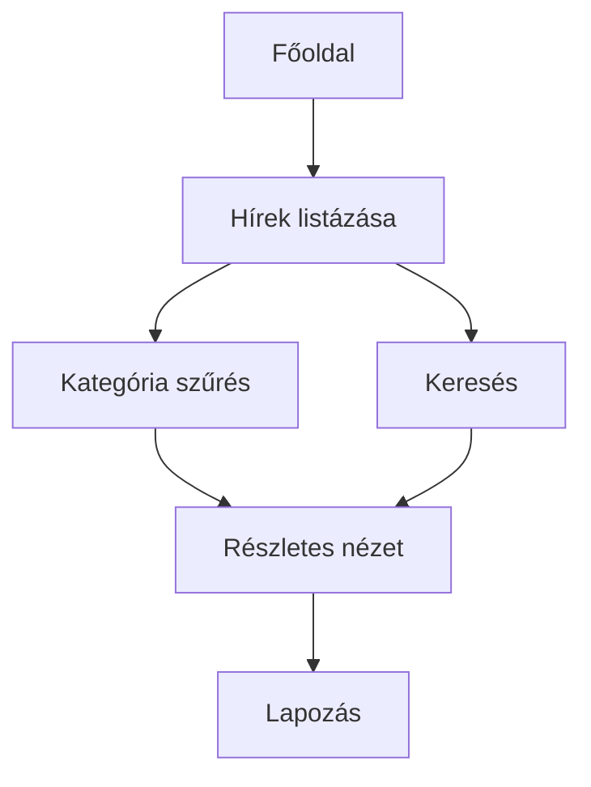
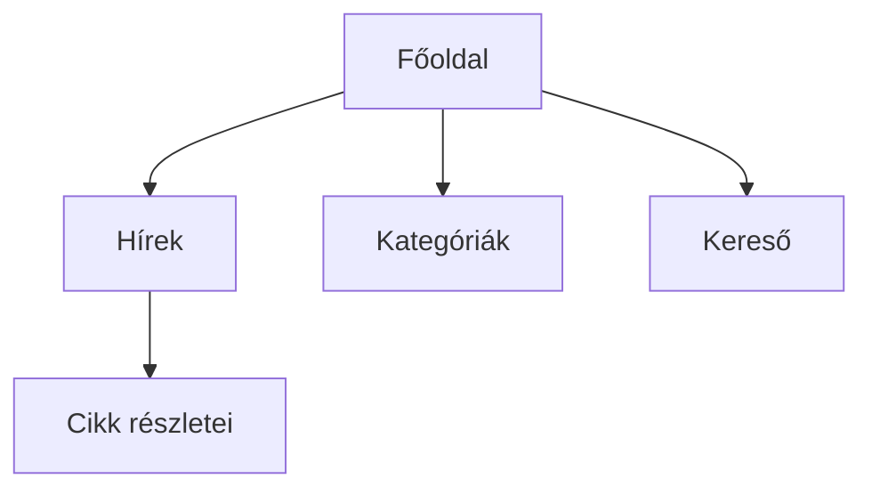
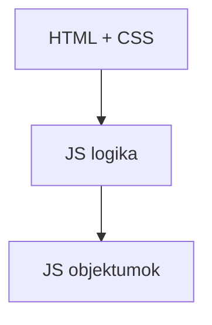

# Rendszerterv – Egyszerű Hírportál

## 1. A rendszer célja

A rendszer célja egy egyszerű webes hírportál létrehozása, amely a hírek közzétételére és átlátható böngészésére szolgál.  
A felhasználók gyorsan és egyszerűen érhetik el a legfrissebb híreket, kategória és kulcsszó alapján kereshetnek.

## 2. Projekt terv

### 2.1 Projekt szerepkörök és felelősségek

- **Megrendelő** – elvárások meghatározása, rendszer elfogadása  
- **Projektvezető** – koordináció, dokumentáció  
- **Frontend fejlesztő** – HTML, CSS, JavaScript  
- **Tesztelő** – funkcionális tesztek  

### 2.2 Fejlesztő eszközök

VS Code, Git, Chrome/Firefox fejlesztői eszközök

## 3. Üzleti folyamatok modellje

### 3.1 Üzleti szereplők

- **Felhasználó** – híroldal látogatója  
- **Rendszer** – hírek megjelenítése, keresés és szűrés  

### 3.2 Üzleti folyamatok



## 3.3 Üzleti entitások

- **Hír:** cím, kivonat, szöveg, dátum, kategória  
- **Kategória:** azonosító, név  

## 4. Követelmények

### 4.1 Funkcionális követelmények

- Hírek listázása időrendben  
- Kategóriák szerinti szűrés  
- Kulcsszavas keresés címben és szövegben  
- Részletes cikk nézet  
- Lapozás nagy elemszám esetén  
- Hibakezelés: „Nincs találat” és 404 oldal  

### 4.2 Nem funkcionális követelmények

- Egyszerű, letisztult felület  
- Gyors betöltés és stabil működés  
- Könnyen karbantartható kód  

## 5. Funkcionális terv

### 5.1 Rendszer szereplők

- Felhasználó  
- Rendszer  

### 5.2 Használati esetek

```mermaid
usecaseDiagram
actor Felhasználó
Felhasználó --> (Hírek listázása)
Felhasználó --> (Keresés)
Felhasználó --> (Kategória választás)
Felhasználó --> (Részletes nézet)
Felhasználó --> (Lapozás)
```

### 5.3 Határ osztályok

- `index.html` – főoldali lista  
- `article.html` – részletes nézet  

### 5.4 Menü hierarchia



### 5.5 Képernyőtervek

- Főoldal: hírek listája, kategória szűrő, keresőmező  
- Részletes cikk nézet: cím, teljes szöveg, dátum, kategória, vissza gomb  

## 6. Fizikai környezet

### 6.1 Fizikai alrendszerek

- HTML réteg  
- CSS megjelenítés  
- JS logika  

## 7. Absztrakt domain modell


## 7.1 Domain specifikáció

Hírek, kategóriák és metaadatok

## 7.2 Absztrakt komponensek

- Hírkezelő modul  
- Szűrő modul  
- Kereső modul  
- Megjelenítő modul  

## 8. Architekturális terv

### 8.1 Tervezési minta

Rétegzett architektúra: UI (HTML/CSS), logika (JS), adat (JS objektumok)



## 8.2 Biztonsági funkciók

- Csak olvasható tartalom  
- Nincs adatbevitel  

## 9. Adatbázis terv


## 10. Implementációs terv

- HTML, CSS, JS fájlok moduláris szerkezete  
- Frontend: hírlap lista, keresés, szűrés, részletes cikk nézet  
- Kódolási alapelvek: moduláris, jól kommentált, könnyen bővíthető  

## 11. Telepítési terv

- Fájlok feltöltése web szerverre  
- Verziókezelés Git segítségével  
- Kézi deploy és ellenőrzés  

## 12. Karbantartási terv

- Hibajavítások manuális teszteléssel  
- Funkciók bővítése igény szerint  
- Verziók nyomon követése Git-ben  