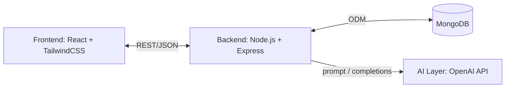
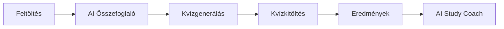
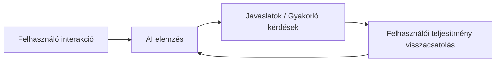
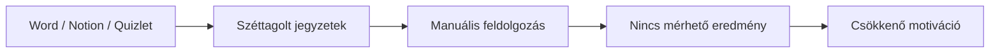
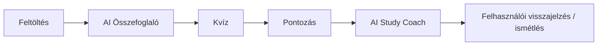
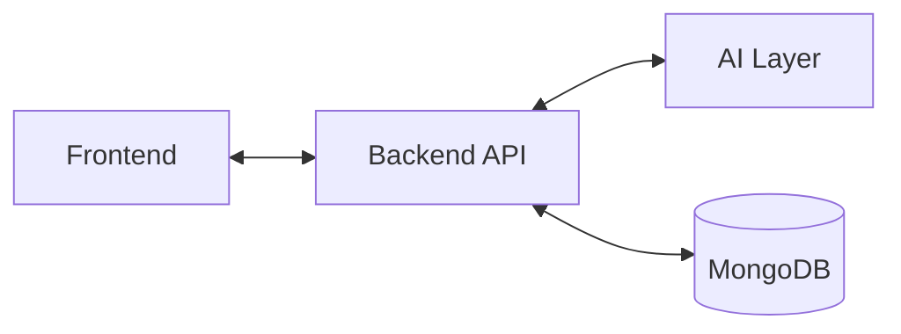
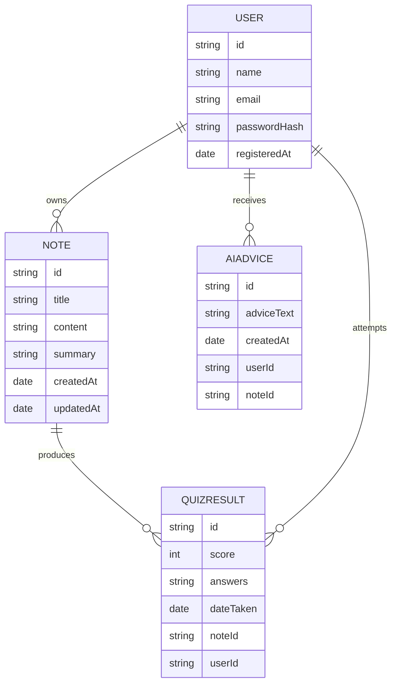
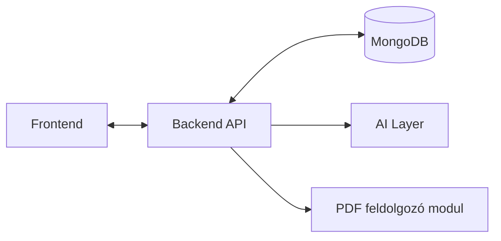
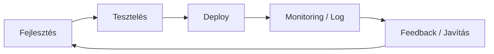

# 🧠 StudyMate AI – Rendszerterv

## 1. Rendszeráttekintés

A **StudyMate AI** egy webalapú, mesterséges intelligenciával támogatott tanulási rendszer, amely a felhasználók által feltöltött jegyzeteket feldolgozza, összefoglalja, kvízeket generál, és személyre szabott tanulási javaslatokat kínál. A rendszer célja a tanulás hatékonyságának növelése és az önálló tanulás támogatása.

### Fő technológiai rétegek – *Ábra 1: Rendszer magas szintű architektúrája*

---

## 2. Projekt leírása

A StudyMate AI célja egy integrált, moduláris tanulástámogató platform létrehozása, ahol a felhasználó a jegyzetfeltöltéstől az AI Study Coach ajánlásáig minden lépésben támogatást kap.

### Fő folyamatok – *Ábra 2: Folyamatlánc diagram*

---

## 3. Vágyálomrendszer

A felhasználó minden tanulási tevékenységet egyetlen platformon végezhet, az AI adaptívan alkalmazkodik a tanulási szokásokhoz.

### Logika – *Ábra 3: Vágyálomrendszer logikája*

---

## 4. Jelenlegi üzleti folyamatok modellje

A hallgatók jelenleg széttagolt eszközöket használnak (Word, Notion, Quizlet), ami manuális feldolgozást, mérhetetlen előrehaladást és alacsony motivációt eredményez.

### Problémák – *Ábra 4: Jelenlegi folyamatok problémái*

---

## 5. Igényelt üzleti folyamatok modellje

Az új rendszer fő folyamatok mentén működik.

### Célfolyamat – *Ábra 5: Igényelt folyamatmodell*

---

## 6. Funkcionális követelmények

- Jegyzetfeltöltés (szöveg / PDF)
- Jegyzetek kezelése (CRUD, metaadatok, verziókövetés)
- AI-összefoglalók generálása
- Kvízkérdések létrehozása és kitöltése
- Pontozás, eredmények mentése
- Felhasználói statisztikák megjelenítése
- AI Study Coach tanulási javaslatokkal
- Biztonságos hitelesítés (JWT)
- Hibakezelés minden modulnál

### Modulnézet – *Ábra 6: Funkcionális modulok áttekintése*

---

## 7. Nem funkcionális követelmények

- Reszponzív és intuitív UI  
- Válaszidő < 2 mp  
- 99,5% rendelkezésre állás  
- Adatbiztonság (HTTPS, titkosítás)  
- Skálázhatóság, horizontális bővíthetőség  
- Moduláris felépítés, könnyű bővíthetőség  
- Hibakezelés és naplózás minden kritikus eseménynél

---

## 8. Adatkezelési követelmények

### Entitások és kapcsolatok – *Ábra 7: Adatkapcsolati diagram*

- Titkosított adatátvitel (HTTPS)  
- Felhasználónként elkülönített adatok  
- GDPR-kompatibilitás

---

## 9. Használati esetek

### 9.1 Jegyzetfeltöltés
- Fájl ellenőrzése, mentése  
- Hibakezelés formátumhiány vagy érvénytelen adat esetén

### 9.2 Összefoglaló generálása
- AI feldolgozás, három bekezdéses összefoglaló  
- Mentés az adatbázisba, szerkesztés lehetősége

### 9.3 Kvízkitöltés
- AI által generált kérdések  
- Pontozás, statisztikák készítése  
- Gyenge pontok jelzése

### 9.4 AI Study Coach
- Gyenge pontok elemzése  
- Személyre szabott gyakorló feladatok ajánlása  
- Azonnali visszajelzés

### 9.5 Profil és statisztika
- Korábbi jegyzetek, AI-javaslatok  
- Grafikonok és statisztikák

---

## 10. Rendszerintegrációs követelmények – *Ábra 8: Rendszerkomponensek integrációja*

- Backend: Node.js + Express, moduláris  
- Frontend: React + TailwindCSS  
- Adatbázis: MongoDB (Mongoose ORM)  
- AI integráció: OpenAI API (GPT-4-turbo vagy újabb)  
- PDF feldolgozás: pdf-parse vagy pdfjs-dist  
- Grafikonok: Chart.js vagy Recharts  
- Hitelesítés: JWT token alapú  
- Fájlfeltöltés: validált, biztonságos

---

## 11. Minőségi követelmények

- Felhasználói élmény: modern, intuitív, átlátható  
- Teljesítmény: gyors válaszidő, optimalizált AI-hívások  
- Megbízhatóság: adatmentés, redundancia, hibatűrő működés  
- Skálázhatóság: több ezer felhasználó támogatása  
- Bővíthetőség: új AI funkciók és modulok könnyű integrálása  
- Biztonság: titkosítás, jogosultság-ellenőrzés  
- Adatvédelem: GDPR-kompatibilitás, auditált hozzáférés

---

## 12. Tesztelési és karbantartási követelmények – *Ábra 9: Tesztelési és karbantartási folyamat*

- Funkcionális és integrációs tesztek  
- Teljesítménytesztek (válaszidő, DB-terhelés, AI-hívások)  
- Felhasználói tesztek (UX)  
- Rendszerkarbantartás: adatmentés, API-frissítés, biztonsági audit  
- Verziókezelés: Git, dokumentált release jegyzék  
- Hibakezelés és monitorozás: logolás, riasztás, dashboard