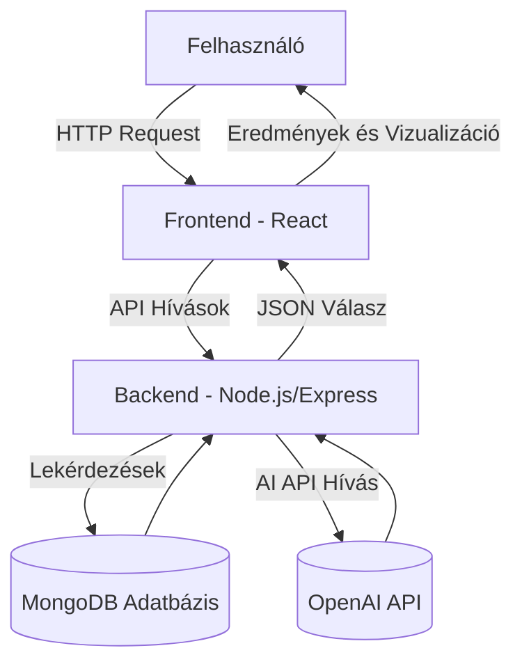
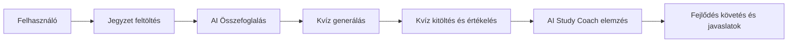
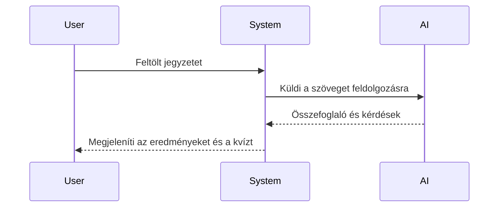
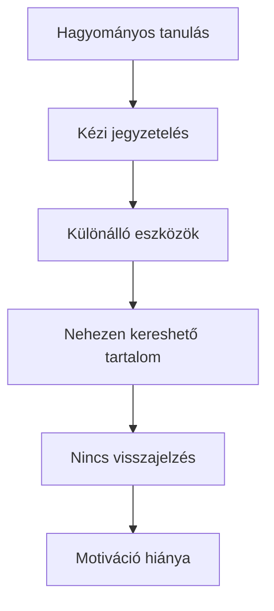
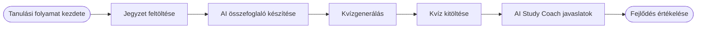
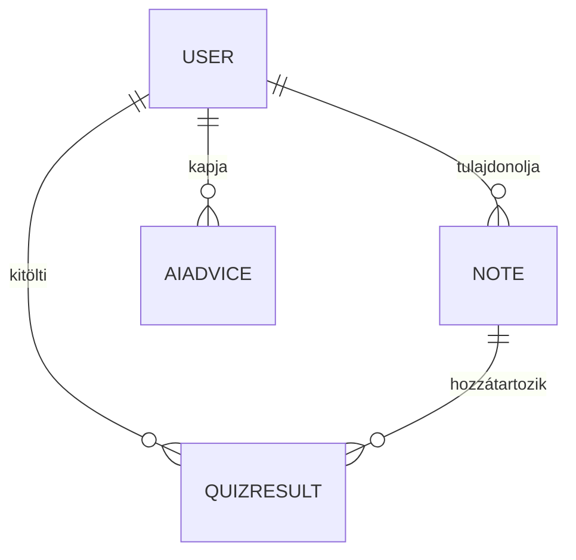
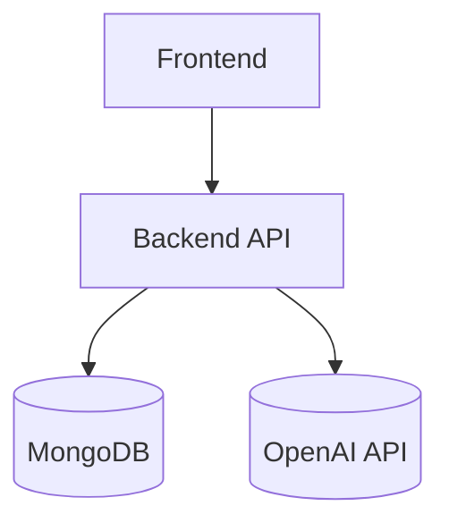
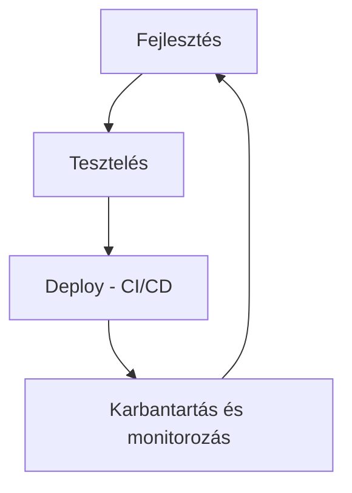

# StudyMate AI – Rendszerterv

## 1. Rendszeráttekintés

A **StudyMate AI** egy webalapú tanulástámogató platform, amely a mesterséges intelligencia segítségével automatizálja a tanulási folyamatokat.  
A rendszer célja, hogy a hallgatók által feltöltött jegyzetekből automatikusan összefoglalókat, kvízkérdéseket és személyre szabott tanulási javaslatokat generáljon.

A rendszer fő komponensei három rétegben helyezkednek el:

- **Frontend:** React + TailwindCSS technológiával készült interaktív felhasználói felület.
- **Backend:** Node.js + Express alapú REST API, amely az üzleti logikát és az AI-integrációkat kezeli.
- **Adatbázis:** MongoDB dokumentum-alapú adatbázis, amely a jegyzeteket, kvízeket és AI-javaslatokat tárolja.

A rendszer architektúrája réteges, moduláris és skálázható, lehetővé téve új funkciók és szolgáltatások hozzáadását anélkül, hogy a fő funkciókat módosítani kellene.

### 1.1 Architektúra leírása

A rendszer **háromrétegű architektúrán** alapul: prezentációs réteg, logikai réteg és adatkezelési réteg.  
A komponensek között **REST API-n keresztüli kommunikáció** történik JSON formátumban.

A **prezentációs réteg** biztosítja a vizuális interakciókat (React), a **logikai réteg** az adatfeldolgozást (Express), az **adatkezelési réteg** pedig a MongoDB-ben tárolja az entitásokat.

### 1.2 Cél és használati környezet

A StudyMate AI célja, hogy egy **oktatási segédrendszerként** szolgáljon, amelyet hallgatók, oktatók és önálló tanulók egyaránt használhatnak.  
A rendszer **felhőalapú környezetben** működik, támogatva a többfelhasználós hozzáférést és az adatbiztonságot (HTTPS, JWT, titkosított adattárolás).

---

## 2. Projektleírás és célkitűzések

A projekt célja egy olyan intelligens tanulási ökoszisztéma megteremtése, amely automatizálja a tanulási folyamatokat, és adatvezérelt módon segíti a felhasználók fejlődését.

A fő funkciók közé tartozik:

- **Jegyzetfeltöltés:** szöveges vagy PDF formátumban.
- **Automatikus összefoglalás:** AI által készített, 3 bekezdéses kivonat.
- **Kvízgenerálás:** a jegyzet alapján 5–10 kérdés.
- **Kvízkitöltés:** pontozás, eredmény-elemzés.
- **AI Study Coach:** tanulási javaslatok a gyenge pontok alapján.

A projekt első verziója MVP szinten az alapfunkciókra koncentrál, de a rendszer nyitott a további bővítésekre, mint például adaptív tanulási útvonalak, gamifikáció vagy közösségi tanulás.

---

## 3. Vágyálomrendszer leírása

Az ideális StudyMate AI rendszer egy önálló, adaptív tanulási ökoszisztéma, amely képes:

- valós idejű elemzéseket készíteni a tanulási szokásokról,
- vizualizált statisztikákat és személyre szabott tanulási útvonalakat nyújtani,
- interaktív visszajelzéseket biztosítani minden egyes tanulási ciklus után.

A vágyálomrendszer képes előre jelezni, mely területek igényelnek több gyakorlást, és akár új tesztanyagokat generálni ezekre a témákra.

### 3.1 Célrendszer viselkedése

A célrendszer viselkedése reaktív és adaptív: az AI minden felhasználói interakciót elemez, és ennek alapján finomhangolja a tanulási javaslatokat.

---

## 4. Jelenlegi üzleti folyamatok modellje

A hagyományos tanulási rendszerekben a diákok manuálisan dolgozzák fel az anyagot, gyakran különböző platformokat használva.  
Ez **időigényes, széttagolt** és **nehezen mérhető** folyamatot eredményez.

A StudyMate AI ezeket a problémákat azáltal küszöböli ki, hogy **automatizálja az információfeldolgozást**, és **egységes tanulási környezetet** biztosít.

---

## 5. Igényelt üzleti folyamatok modellje

A StudyMate AI célja az automatizált és adatvezérelt tanulási folyamat bevezetése.  
A felhasználó útja a rendszerben az alábbi lépésekből áll:

1. Jegyzet feltöltése
2. AI összefoglaló generálása
3. Kvízkérdések készítése
4. Kvíz kitöltése és pontozás
5. AI Study Coach javaslatok megtekintése

---

## 6. Funkcionális követelmények

A rendszer fő funkciói a következők:

- Jegyzetfeltöltés PDF-ben vagy szövegként
- Összefoglaló készítése AI segítségével
- Kvízkérdések generálása és tárolása
- Kvízkitöltés és automatikus pontozás
- Eredmények mentése és vizualizálása
- AI Study Coach elemzések és tanácsok
- Profil és statisztika megjelenítése
- Biztonságos bejelentkezés és adatkezelés

A funkciók modulárisan épülnek fel, így az egyes komponensek külön fejleszthetők és tesztelhetők.

---

## 7. Nem funkcionális követelmények

A nem funkcionális követelmények biztosítják a rendszer teljesítményét, megbízhatóságát és használhatóságát.

### 7.1 Teljesítmény

- A fő műveletek válaszideje maximum 2 másodperc.
- Az AI-hívások cache-eléssel optimalizáltak.
- A rendszer horizontálisan skálázható.

### 7.2 Megbízhatóság és rendelkezésre állás

- 99,5%-os rendelkezésre állás.
- Redundáns adatmentés és hibatűrés.
- Folyamatos logolás és hibadetektálás.

### 7.3 Biztonság és adatvédelem

- HTTPS protokoll és JWT token alapú hitelesítés.
- Adattitkosítás és jogosultságkezelés minden rétegben.
- GDPR-kompatibilis adatkezelés.

---

## 8. Adatkezelési követelmények

Az adatmodell négy fő entitásra épül: **User**, **Note**, **QuizResult**, **AiAdvice**.

Az adatok titkosított formában kerülnek tárolásra, és kizárólag a tulajdonos felhasználó fér hozzá.  
Az adatbázis Mongoose ORM-mel kezelve biztosítja a sémák konzisztenciáját és a relációk átláthatóságát.

---

## 9. Használati esetek

### 9.1 Jegyzetfeltöltés
A felhasználó új jegyzetet tölt fel. A backend feldolgozza és menti a fájlt.  
A rendszer ellenőrzi a formátumot, majd az AI automatikusan elindítható az összefoglaló készítésére.

### 9.2 Összefoglaló generálása
A backend elküldi az anyagot az AI-nak, majd az eredményt visszatölti az adatbázisba.  
A felhasználó megtekintheti, szerkesztheti és mentheti az összefoglalót.

### 9.3 Kvízkitöltés
A generált kérdésekből a felhasználó kvízt indít.  
A backend pontozza, menti az eredményt, és az AI Study Coach javaslatokat készít az elemzéshez.

### 9.4 Profil és statisztika
A felhasználó grafikonokon keresztül láthatja fejlődését és korábbi eredményeit.

---

## 10. Rendszerintegrációs követelmények

- **Backend:** Node.js + Express REST API
- **Frontend:** React + TailwindCSS
- **Adatbázis:** MongoDB (Mongoose ORM)
- **AI integráció:** OpenAI API
- **PDF feldolgozás:** pdf-parse / pdfjs-dist
- **Grafikonok:** Chart.js vagy Recharts
- **Hitelesítés:** JWT alapú rendszer

---

## 11. Minőségi követelmények

A minőségi szempontok célja a hosszú távú fenntarthatóság és fejleszthetőség biztosítása.

- Felhasználói élmény: modern, reszponzív UI.
- Teljesítmény: gyors API válaszidők és cache-elés.
- Megbízhatóság: redundáns adatmentés és visszaállítás.
- Biztonság: titkosított kommunikáció, erős autentikáció.
- Skálázhatóság: több ezer felhasználó támogatása.

---

## 12. Tesztelési és karbantartási követelmények

### 12.1 Tesztelési terv

- **Egységtesztek:** minden modulra külön (Jest vagy Mocha).
- **Integrációs tesztek:** frontend–backend–AI API kapcsolat ellenőrzése.
- **Teljesítménytesztek:** válaszidő és adatbázis-terhelés mérése.
- **Felhasználói tesztek:** UX validálás, hibajavítás.

### 12.2 Karbantartás

- Rendszeres adatmentések és audit naplók.
- Verziókövetés Git alapon, CI/CD integrációval.
- Hibalogok és riasztások automatizált feldolgozása.

